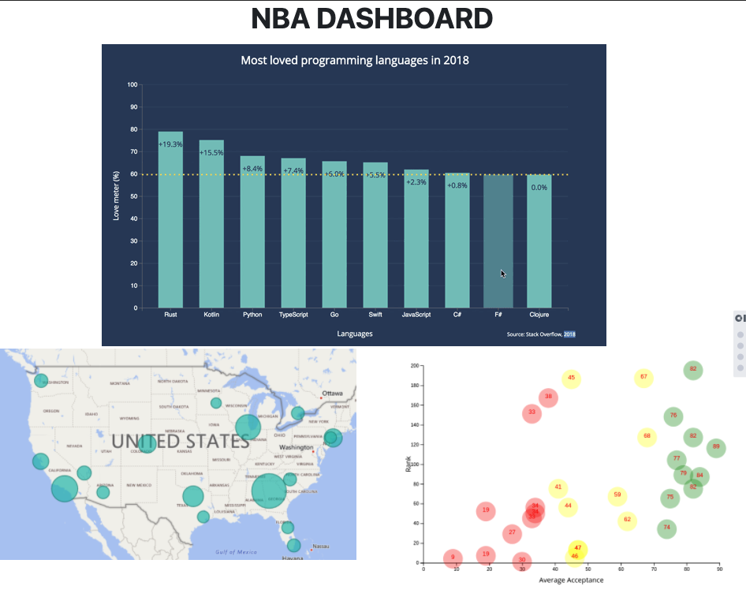

# A Look Back on Kobe Bryant's Career

## Project 2

__Members:__ Kim Sommer, Howard Mayorga, Stephanie Rivas & Ian Castro 

__Project Description and Outline:__ Our dashboard will tell the story of Kobe Bryant's career by giving the audience a view into his various stats over the years he played in the NBA. We will feature an interactive scatter plot that will show points scored, assists, blocks and other statistics by year. The user will choose the desired stat to view, and the plot will update with that information. The user can then select the scatter plot points to view data about the specific game being plotted to see the numbers up close. A map will finish the visualization of Kobe's career with plot points showing the cities in which he played games along with an infographic that gives the average of Kobe's points scored in those cities.

__Metrics: __
1. Our visualizations will include a Python Flask–powered API, HTML/CSS, JavaScript, and at least one database (SQL, MongoDB, SQLite, etc.). 
2. Your project should fall into one of the below four tracks: 
	○ A custom “creative” D3.js project (i.e., a nonstandard graph or chart) 
	○ A combination of web scraping and Leaflet or Plotly 
	○ A dashboard page with multiple charts that update from the same data 
	○ A “thick” server that performs multiple manipulations on data in a database prior to visualization (must be approved) 
3. Our project will include at least one JS library that we did not cover. 
4. It must be powered by a data set with at least 100 records. 
5. The project must include some level of user-driven interaction (e.g., menus, dropdowns, textboxes). 
6. The final visualization should ideally include at least three views. 

__Datasets:__

https://rapidapi.com/theapiguy/api/free-nba?endpoint=apiendpoint_0c94f219-1d0f-4fc1-8bbb-c5ee6b8327cc

__Rough Breakdown of Tasks:__
* Decompose the problem.
* Examine and learn about each API & write request loops to pull appropriate data from each API.
* Run loops & Put data into DataFrame.
* Clean and merge  data.
* Visualize and Analyze Data.
* Make Observations regarding the tendencies we see.
* Create Presentation and Summary Documents and make the Project accessible.

### Project Website Sketch

